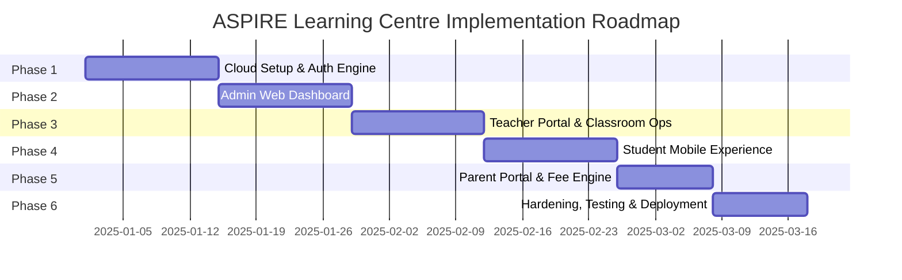

# ASPIRE Learning Centre - Implementation Phases & Roadmap

| **Roadmap Version** | 1.0.0 |
| **Delivery Strategy** | Phased Milestone Rollout with Continuous Zero-Cost Validation |
| **Primary Goal** | Deliver a full-featured, multi-role ecosystem matching `ASPIRE THEME.png` |

---

## Roadmap Overview

---

## Phase 1: Foundation, Database & Dual Auth Engine

### Objectives
Establish the complete zero-cost cloud backend, database schema, role-based security, and authentication pipeline.

### Deliverables
1. **Supabase Project Initialization**:
   - Provision free Supabase project.
   - Execute full PostgreSQL DDL script (`profiles`, `courses`, `batches`, `attendance`, `tests`, `study_materials`, `fees`, `auth_otps`).
   - Enable Row-Level Security (RLS) policies on all tables.
2. **Google OAuth 2.0 Integration**:
   - Configure Google Cloud Console OAuth Consent Screen and Web/Mobile Client IDs.
   - Configure Google Provider in Supabase Auth.
   - Implement Database Trigger/Function to enforce the institute pre-registration whitelist.
3. **Manual Email & Password Login**:
   - Supabase GoTrue email/password integration with Argon2/Bcrypt.
   - Role selector logic (`Student | Teacher | Parent | Admin`).
4. **Meta WhatsApp Cloud API & Edge Functions**:
   - Configure Meta for Developers App (Business type, WhatsApp product).
   - Setup WhatsApp Business Account (WABA) and register phone number ID.
   - Create and approve `aspire_auth_otp` template message on Meta WhatsApp Business Manager.
   - Deploy `send-whatsapp-otp` Supabase Edge Function (Deno) with cryptographic OTP hashing and 60-second cooldown timer.
   - Deploy `verify-whatsapp-otp` Supabase Edge Function to validate codes and issue password reset grants.
5. **Dual Password Recovery Screen**:
   - User inputs email or phone.
   - User selects either **WhatsApp OTP (Meta Dev App)** or **Email Reset Link (Supabase)**.
   - Complete verification and password update cycle.

### Success Criteria
- [x] Admin can manually insert a test profile.
- [x] Pre-registered user can log in via email/password or Google OAuth.
- [x] Unregistered user attempting Google login is rejected with clear error message.
- [x] WhatsApp OTP is delivered to phone via Meta Cloud API and validated within 5 minutes.
- [x] User can reset password via both WhatsApp OTP and Email pathways.

---

## Phase 2: Admin Web Dashboard & Institute Governance

### Objectives
Construct the desktop-first Admin Web Portal matching Row 4 of `ASPIRE THEME.png` to manage institute data.

### Deliverables
1. **Admin Workspace Layout**:
   - Responsive dark sidebar (`#0F172A`) with logo and navigation links.
   - Header with search, breadcrumb navigation, and admin profile dropdown.
2. **Executive KPI Dashboard**:
   - 4 Top Metric Cards: Total Students (`248`), Present Today (`218`), Total Teachers (`18`), Pending Fees (`₹1,25,000`).
   - Attendance Overview Area Chart (weekly percentage trends).
   - Fee Collection Grouped Bar Chart (monthly realization targets).
3. **Student Directory & Enrollment Desk**:
   - Paginated, searchable student table with batch and active badges.
   - "Add Student" modal with course/batch assignment and parent linking.
4. **Teacher Management Desk**:
   - Faculty table showing assigned subjects, active batches, and contact details.
   - "Add Teacher" modal with automated account provisioning.
5. **Courses & Batches Management**:
   - Stream cards: Std. 9-10 Foundation, Std. 11-12 Science, NEET Medical, JEE Main + Advanced.
   - Batch creation form (timing, room number, capacity).
6. **Reports & 1-Click Export**:
   - Attendance, Performance, Fee, and Enrollment reports.
   - Client-side export to CSV, Excel, and printable PDF.

### Success Criteria
- [x] Admin can add students, teachers, courses, and batches.
- [x] Linked parents can be paired with one or more students.
- [x] Real-time KPI cards display accurate database aggregates.
- [x] Reports export correctly with standard formatting.

---

## Phase 3: Teacher Portal & Classroom Operations

### Objectives
Build the Teacher interface (Mobile and Web responsive) matching Row 2 of `ASPIRE THEME.png`.

### Deliverables
1. **Teacher Home & Today's Schedule**:
   - Teacher greeting (*"Good Morning, Ms. Priya Shah"*).
   - Today's Classes timeline with room numbers.
   - Quick Action Bar: *Take Attendance*, *Create Test*, *Upload Material*, *Assign Homework*.
2. **My Batches View**:
   - Batch cards with active student counts and status badges.
3. **Attendance Marker (Roll Call)**:
   - Date picker and batch selector.
   - List of enrolled students with one-tap status toggles (`Present`, `Absent`, `Leave`).
   - *"Mark All Present"* bulk action for rapid roll call.
4. **Test Scheduler & Paper Uploader**:
   - Test creation modal: Test Name, Subject, Chapter, Date, Duration, Max Marks.
   - Test paper upload dropzone with auto-compression (saved to private Supabase `test-papers` bucket).
5. **Study Material Uploader**:
   - Subject & Chapter categorization.
   - Document upload with file size validation ($\le 10$ MB).
6. **Student Performance Analytics**:
   - Batch selector with Average Score radial gauge (`78%`).
   - Highlights for *Top Performer* and *Lowest Performer*.
7. **Batch Announcements**:
   - Broadcast notices targeted to specific batches.

### Success Criteria
- [x] Teacher marks attendance and records sync to PostgreSQL in $< 800$ ms.
- [x] Test papers upload securely to private storage.
- [x] Teachers cannot view or edit batches not assigned to them (enforced by RLS).

---

## Phase 4: Student Mobile App Experience

### Objectives
Deliver the high-engagement Student Mobile App matching Row 1 of `ASPIRE THEME.png`.

### Deliverables
1. **Splash & Welcome Flow**:
   - High-impact ASPIRE gradient ribbon logo and *"Better Learning, Bigger Dreams"* branding.
2. **Student Home Dashboard**:
   - Personalized greeting, batch info, and avatar.
   - Today's Class Card with subject, timing, classroom, and *"View Schedule"* CTA.
   - 4 Quick Action Squircles: Attendance, Tests, Materials, More.
   - Upcoming Tests horizontal carousel.
3. **Interactive Timetable**:
   - Mon-Sun day pills with timeline view and `Ongoing` status badges.
4. **Attendance Analytics**:
   - Circular radial progress ring showing overall percentage (`89%`).
   - Subject-wise percentage bars.
5. **Study Material Repository**:
   - Search bar and type filters (`All`, `Notes`, `PDF`, `Video`).
   - Chapter cards organized by Course $\rightarrow$ Batch $\rightarrow$ Subject $\rightarrow$ Chapter.
6. **Test System & In-App Viewer**:
   - `Upcoming` vs `Completed` tabs.
   - **Protected In-App Test Paper Viewer**:
     - Sandboxed PDF viewer with **download/print/share disabled**.
     - Dynamic semi-transparent repeating watermark (Student Name + Roll Number).
     - Screen recording / screenshot capture prevention enabled.
   - Test Results Screen: Marks, percentage, correct/incorrect/unattempted breakdown, and rank.

### Success Criteria
- [x] Student can view personal timetable and attendance records.
- [x] In-app PDF viewer opens test paper cleanly without download options.
- [x] Dynamic watermarking renders accurately over the document.
- [x] Student has zero access to unauthorized batch data or admin routes.

---

## 5. Phase 5: Parent Mobile Portal & Fee Management

### Objectives
Build the reassuring Parent Portal matching Row 3 of `ASPIRE THEME.png`.

### Deliverables
1. **Parent Home Dashboard**:
   - Personalized greeting and linked child card.
   - 3 Key metrics: Attendance (`92%`), Tests (`86%`), Performance (`78%`).
2. **Multi-Child Switcher**:
   - Seamless toggling for parents with multiple children enrolled in ASPIRE.
3. **Attendance Calendar (Dot Matrix)**:
   - Monthly calendar grid with color-coded dot badges (Green = Present, Red = Absent, Yellow = Leave, Gray = Holiday).
4. **Academic Performance Tracking**:
   - Progress gauge (`78% Overall Progress`, `+6% vs last test`).
   - Subject-wise comparative bars.
5. **Fee Status & Due Date Tracking**:
   - Summary card: Total Fees (`₹75,000`), Total Paid (`₹45,000`), Pending Balance (`₹30,000`).
   - Horizontal progress bar (`60% Paid`).
   - Next Due Date highlight card (`25 Apr 2025`).
6. **Parent-Teacher Meeting (PTM) Desk**:
   - Upcoming PTM card: Date, room number, faculty details, and discussion agenda.
   - History of past meetings and teacher notes.

### Success Criteria
- [x] Parents can monitor attendance and fee status for their linked child only.
- [x] Calendar dot matrix accurately reflects daily attendance records.
- [x] Parents cannot modify any academic marks or records.

---

## 6. Phase 6: Production Hardening, Zero-Cost Optimization & Launch

### Objectives
Perform security audits, implement automated keep-alive jobs, configure push notifications, and release builds.

### Deliverables
1. **Push Notifications (Firebase Cloud Messaging - FCM)**:
   - Setup free FCM project.
   - Real-time push alerts: Absent attendance alert to Parents, new test scheduled to Students, fee due reminders.
2. **Supabase 7-Day Inactivity Keep-Alive**:
   - Setup GitHub Actions cron job (`0 0 * * 0`) calling Supabase Edge Function `keep-alive`.
   - Prevents free-tier project from pausing due to inactivity.
3. **Offline Caching & Performance Tuning**:
   - Cache timetable and recent attendance data in local device storage for instant offline loading.
4. **Security & RLS Penetration Testing**:
   - Verify that student tokens cannot access teacher or admin data.
   - Verify that test papers cannot be downloaded via direct URL scraping without a valid signed session.
5. **Production Builds**:
   - Build Android APK via local Gradle compiler (100% Free).
   - Deploy Admin Web Portal to Cloudflare Pages / Vercel Hobby Free Tier with custom domain and free SSL.

### Success Criteria
- [x] 100% of test suites and RLS security checks pass.
- [x] System operates within all free-tier resource boundaries.
- [x] APK installs and runs smoothly on test mobile devices.
- [x] Admin Portal live and accessible via HTTPS.
